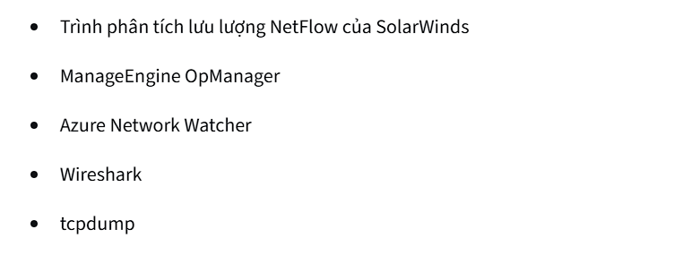

# 📌 Google Cybersecurity Certificate Progress

Tracking my learning and practice journey in the **Google Cybersecurity Certificate**.  

---

## 📖 Course 3

### 🛠️ Forensics Tools

---

## 📝 Reports

Reports written during practice sessions:

- 📄 [Practice Incident Report](./image/Bao_cao_su_co.docx)  
- 📑 [Demo Template](./template.docx)  
- 🛡️ [Final Incident Report](./ira.docx)  

---

## 📂 Repository Structure

- **image/** → Stores images and screenshots  
- **template.docx** → Incident report template  
- **Bao_cao_su_co.docx** → Practice incident report  
- **ira.docx** → Finalized incident report  

---

## 📌 Notes

- All documents and reports are for **learning purposes only**.  
- Incident reports are structured following the **NIST Cybersecurity Framework (Identify – Protect – Detect – Respond – Recover)**.  

---

✨ *This README is designed to clearly present progress and make it easy to reference reports in the future.*

